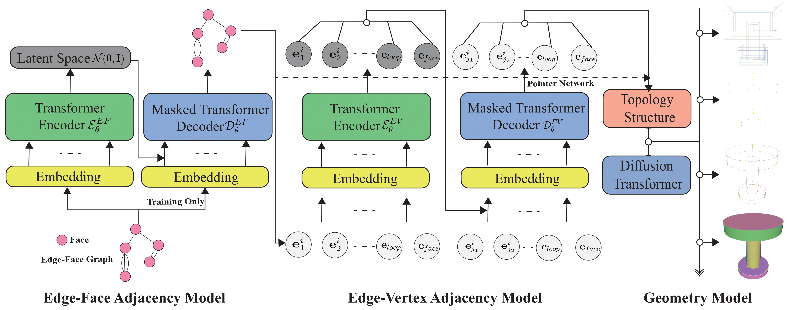
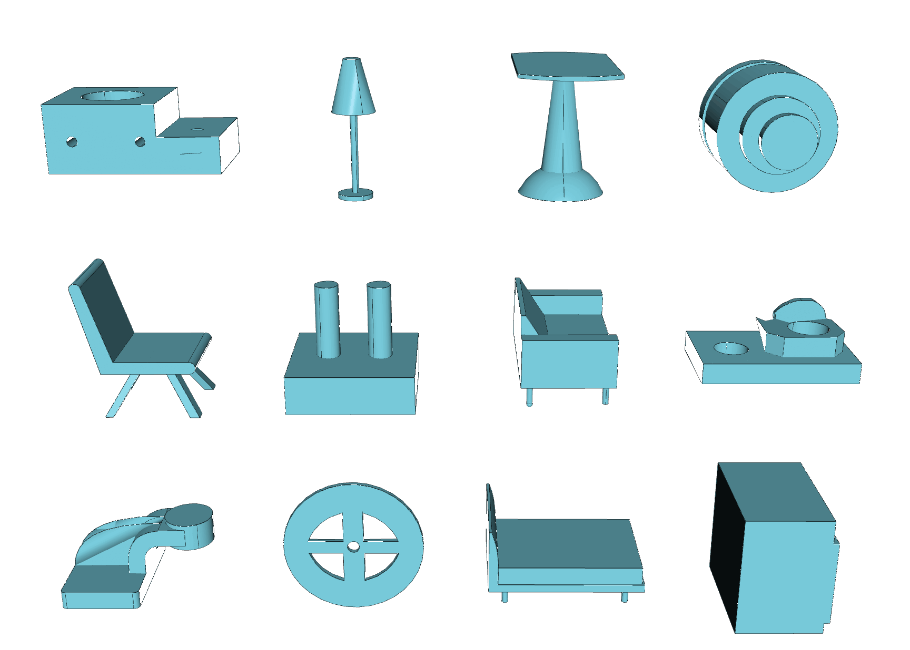
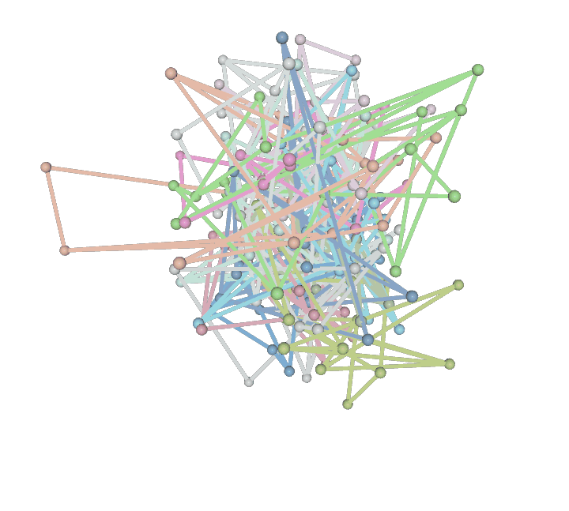
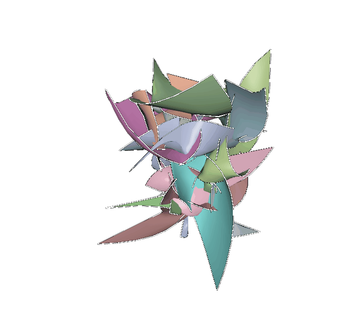
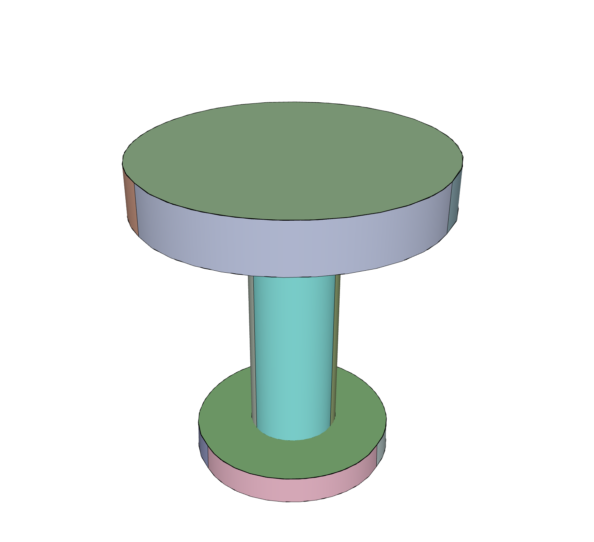

# DTGBrepGen: A Novel B-rep Generative Model through Decoupling Topology and Geometry 
(CVPR2025 Submisson Paper ID: 15932)

### Abstract
Boundary representation (B-rep) of geometric models is a fundamental format in Computer-Aided Design (CAD). However,  automatically generating valid and high-quality B-rep models remains challenging due to the complex interdependence between the topology and geometry of the models. Existing methods tend to prioritize geometric representation while giving insufficient attention to topological constraints, making it difficult to maintain structural validity and geometric accuracy. In this paper, we propose DTGBrepGen, a novel topology-geometry decoupled framework for B-rep generation that explicitly addresses both aspects. Our approach first generates valid topological structures through a two-stage process that independently models edge-face and edge-vertex adjacency relationships. Subsequently, we employ Transformer-based diffusion models for sequential geometry generation, progressively generating vertex coordinates, followed by edge geometries and face geometries which are represented as B-splines. Extensive experiments on diverse CAD datasets show that DTGBrepGen significantly outperforms existing methods in both topological validity and geometric accuracy, achieving higher validity rates and producing more diverse and realistic B-reps.

### Pipeline
<p align="center">
  
</p>

<p align="center">
  
  
  
  
</p>


### Dependencies

To set up the environment and install dependencies, run:
```
conda create --name DTGBrepGen python=3.10.13 -y
conda activate DTGBrepGen

pip install torch==2.2.2 torchvision==0.17.2 torchaudio==2.2.2 --index-url https://download.pytorch.org/whl/cu121

pip install -r requirements.txt
pip install chamferdist
```

For OCCWL installation, follow the instructions [here](https://github.com/AutodeskAILab/occwl).

### Pre-trained Models
Download our pre-trained models from this [link](https://).

### Dataset
You can download the datasets from the following sources:
- [ABC Dataset](https://archive.nyu.edu/handle/2451/43778)
- [DeepCAD dataaset](https://github.com/ChrisWu1997/DeepCAD) 

To preprocess the dataset, run:
```
python -m data_process.brep_process
```

### Training
To train the model, execute:
```
sh scripts/script.sh
```
This will train all models. To train specific models, comment out the corresponding lines in the script.

### Sampling
To generate B-rep models, run:
```
python -m inference.generate
```
Specify the name of the dataset in the main function to generate corresponding B-rep models.